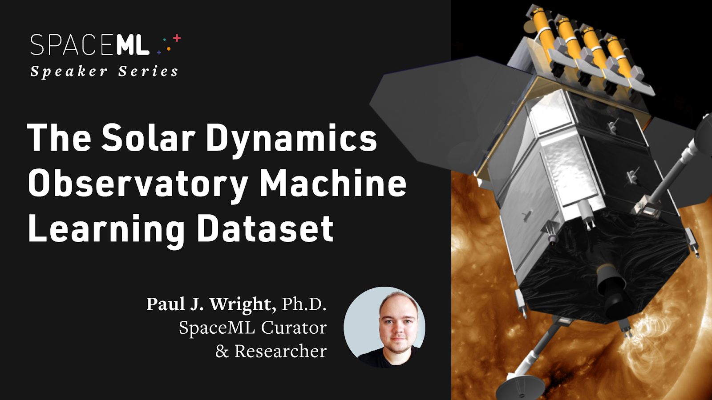

# SDOML Dataset

*A curated data set from the NASA Solar Dynamics Observatory (SDO) mission in a format suitable for machine-learning research.*

## SDO Overview
Since its launch in 2010, NASA’s Solar Dynamics Observatory (SDO; (Pesnell et al. 2012) has continuously monitored Sun's activity, delivering a wealth of valuable scientific data for heliophysics researchers with the use of three instruments:

1. The Atmospheric Imaging Assembly (AIA; Lemen et al. 2012), which captures 4096 x 4096 resolution images (with 0.6 arcsecond pixel size) of the full Sun in two ultraviolet (centered at 1600, and 1700 Å), seven extreme ultraviolet (EUV; centered at 94, 131, 171, 193, 211, 304, and 335 Å), and one visible (centered at 4500 Å) wavelength band.

2. The Helioseismic and Magnetic Imager (HMI; Schou et al. 2012) captures visible wavelength filtergrams of the full Sun at 4096 x 4096 resolution (a pixel size of 0.5 arcsecond), which are then processed into a number of data products, including photospheric Dopplergrams, line-of-sight magnetograms, and vector magnetograms (Hoeksema et al. 2014).

3. The EUV Variability Experiment (EVE; Woods et al. 2012) monitors the solar EUV spectral irradiance from 1 to 1050 Å. This is done by utilizing multiple EUV Grating Spectrographs (MEGS) that disperse EUV light from the full disk of the Sun and its corona onto a 1024 x 2048 charge coupled device (CCD).

## The SDO ML Dataset
The SDO ML Dataset (covering 2010 - 2018) was originally published as Galvez et al (2019), and is hosted on the Stanford Digital Repository in Numpy's compressed array format (`.npz`).

In this notebook, we present an update to the work outlined in Galvez et al (2019), in which the full dataset has been converted to cloud friendly Zarr format. Specifically, SDO/AIA data has been updated to account for a change in calibration after 2019. In addtion to the change in calibration, this updated format includes:

1. FITS header/keyword information (such as observation time, and exposure time).
2. Processes for continually updating the data until the present day.

## Who is the SDO ML Dataset for?

The sheer volume of structured scientific data recorded by SDO (over 18 PB, and counting) is ideal for a range machine learning tasks (from time-series, to computer vision), as well as more traditional approaches.

While the level 1 data are easily accessible, pre-processing these data for scientific analysis often requires specialized heliophysics (and instrument-specific) knowledge. This may act as an unnecessary hurdle for non-heliophysics machine learning researchers who may wish to experiment with datasets from the physical sciences, but are unaware of domain-specific nuances (e.g., that images must be spatially and temporally adjusted).

This notebook demonstrates the process for interacting with a subset of the curated SDO (AIA, HMI, EVE) dataset, that is mission-ready for machine-learning applications. Our aim is to supply this standardized dataset for heliophysicists who wish to use machine learning in their own research, as well as machine-learning researchers who wish to develop models specialized for the physical sciences.

## SpaceML Speaker Series

For a video overview of the SDOML dataset, check out [Episode 1 of the SpaceML Speaker Series](https://www.youtube.com/watch?v=5KNFmnyWRQk)! 

